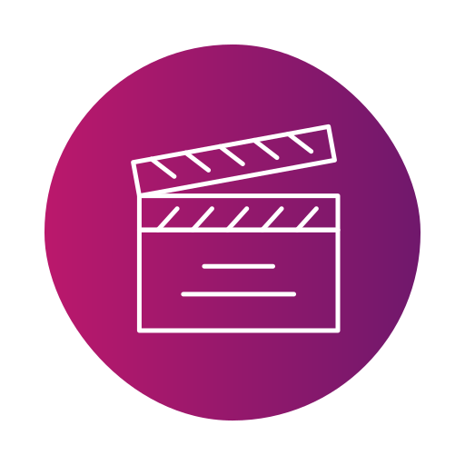
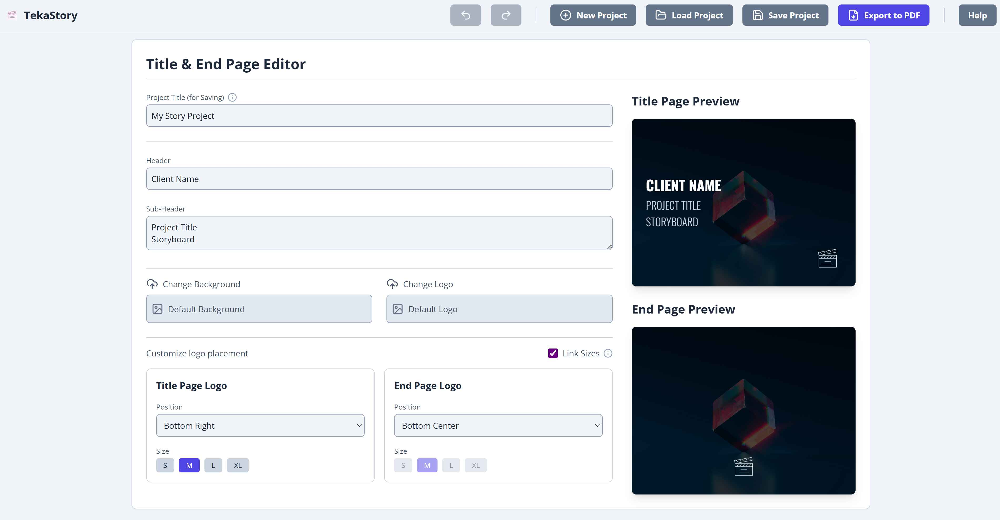
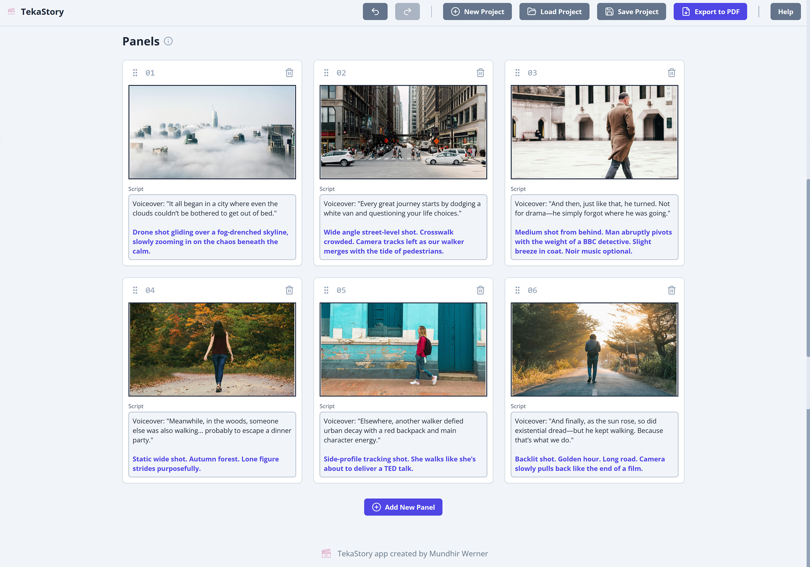

# TekaStory - Visual Storyboard Creator

<div align="center">
  
</div>
<br/>
<p align="center">
  <strong>A powerful and intuitive application for creating, managing, and exporting storyboards. Visually plan your narrative with customizable panels, title pages, and end cards.</strong>
</p>
<p align="center">
  
  
  
  
</p>

---

### Application Preview

<p align="center">
  
</p>
<p align="center">
  
</p>

## 🎨 Sample Project

To see TekaStory in action, a sample project is included in the `/sample_project` directory.

-   `sample_project-250726-2032.tekastory`: The project file. Use the "Load Project" button in the app to open it and explore its contents.
-   `sample_project-250726.pdf`: The final PDF export of the sample project. This demonstrates the high-quality output you can achieve.

## ✨ Key Features

-   **Unified Title & End Pages**: Control your story's start and end from a single, streamlined editor. Customize backgrounds, logos, text, and layout with live previews.
-   **Dynamic Storyboard Canvas**: Add, remove, and reorder panels with a fluid drag-and-drop interface.
-   **Rich Panel Content**: Each panel supports an image and a script. Use `[square brackets]` to highlight actions or directions, which are rendered in a distinct color.
-   **Vector PDF Export**: Generate a clean, professional, vector-based PDF of your entire storyboard with one click. All text and shapes remain sharp at any zoom level.
-   **Self-Contained Projects**: Save your entire project—state, settings, and all image assets—into a single `.tekastory` file for easy portability and versioning.
-   **Undo/Redo History**: Work confidently with a robust history stack tracking your changes.
-   **Cross-Platform Native Experience**: Built with Tauri for a fast, native desktop experience on Windows, macOS, and Linux.

## 🛠️ Tech Stack

-   **Framework**: [React](https://react.dev/)
-   **Desktop Wrapper**: [Tauri](https://tauri.app/)
-   **Language**: [TypeScript](https://www.typescriptlang.org/)
-   **Bundler**: [Vite](https://vitejs.dev/)
-   **State Management**: [Zustand](https://github.com/pmndrs/zustand) (with `immer` for mutations and `zundo` for undo/redo history)
-   **Styling**: [Tailwind CSS](https://tailwindcss.com/) with a rich set of CSS Custom Properties for powerful theming.
-   **Drag & Drop**: [dnd-kit](https://dndkit.com/)
-   **PDF Generation**: [jsPDF](https://github.com/parallax/jsPDF)
-   **Icons**: [Lucide React](https://lucide.dev/)

## 🚀 Getting Started

Follow these instructions to get a local development copy up and running.

### Prerequisites

Before you begin, ensure you have the following installed on your system:
1.  **Node.js & npm**: [Download Node.js](https://nodejs.org/) (npm is included).
2.  **Rust & Cargo**: Follow the instructions on the [official Rust website](https://www.rust-lang.org/tools/install).
3.  **Tauri Prerequisites**: Follow the official Tauri guide to set up your system for Tauri development: [tauri.app/v1/guides/getting-started/prerequisites](https://tauri.app/v1/guides/getting-started/prerequisites).

### Installation & Running

1.  **Download the Source Code**
    Clone the repository to your local machine to get the full source code:
    ```sh
    git clone https://github.com/emzakit/tekastory.git
    cd tekastory
    ```

2.  **Install Node.js dependencies:**
    ```sh
    npm install
    ```

3.  **Run the application in development mode:**
    This command will start the Vite frontend dev server and launch the Tauri desktop application.
    ```sh
    npm run dev
    ```

### Building the Application

To build the application for production, run:
```sh
npm run build
```
This will create a native executable for your operating system in the `src-tauri/target/release/` directory.

## 📁 Project Structure

```
.
├── src/                      # React frontend source code
│   ├── components/           # React components, organized by feature
│   │   ├── canvas/           # Storyboard canvas and panels
│   │   ├── common/           # Shared components (e.g., Logo)
│   │   ├── editors/          # Main editor interfaces
│   │   ├── layout/           # Layout components (e.g., Header)
│   │   ├── preview/          # Live preview components
│   │   └── ui/               # Basic UI elements (Button, Input, Icon)
│   ├── config/               # App configuration (static text, theme object)
│   ├── hooks/                # Custom React hooks (e.g., keyboard shortcuts)
│   ├── lib/                  # Core application logic and services
│   │   ├── asset-service.ts  # In-memory management of image assets
│   │   ├── pdf-service.ts    # Main PDF generation orchestrator
│   │   ├── project-service.ts# Logic for saving/loading .tekastory files
│   │   └── ...               # Other helpers for PDF, Tauri, etc.
│   ├── store/                # Zustand global state management
│   ├── types/                # TypeScript type definitions
│   ├── App.tsx               # Root application component
│   └── index.tsx             # Application entry point
├── src-tauri/                # Tauri backend (Rust) and desktop configuration
├── README.md                 # You are here!
└── ...
```

## 📦 The `.tekastory` File Format

A core feature of TekaStory is its self-contained project file.

**Pro Tip**: A `.tekastory` file is actually a standard `.zip` archive! If you ever need to quickly access your raw image assets or the project data, you can simply rename the file extension from `.tekastory` to `.zip` and extract its contents.

Inside, you will find:
-   `project.json`: Contains all the text data, settings, and references to your assets.
-   `/assets`: A folder containing all the image files (backgrounds, logos, panel images) used in your project.

## ⌨️ Keyboard Shortcuts

| Shortcut                      | Action            |
| ----------------------------- | ----------------- |
| `Ctrl`/`Cmd` + `S`            | Save Project      |
| `Ctrl`/`Cmd` + `O`            | Load Project      |
| `Ctrl`/`Cmd` + `B`            | Add New Panel     |
| `Ctrl`/`Cmd` + `Z`            | Undo Last Action  |
| `Ctrl`/`Cmd` + `Shift` + `Z`  | Redo Last Action  |
| `Ctrl`/`Cmd` + `Y`            | Redo Last Action  |

## 🤖 The Emzakit Project
This application is part of my ongoing **Emzakit** project, where I explore and utilise AI to develop useful applications.

**AI tools used in this project:**
*   Google AI Studio
*   ChatGPT 4o

## 📄 License

This project is licensed under the MIT License. A copy of the license text is included in the application's help documentation.

<hr>
<p align="center">Created with ❤️ by Mundhir Werner</p>
